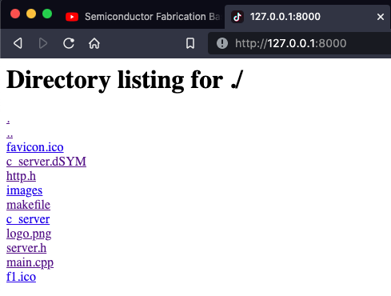
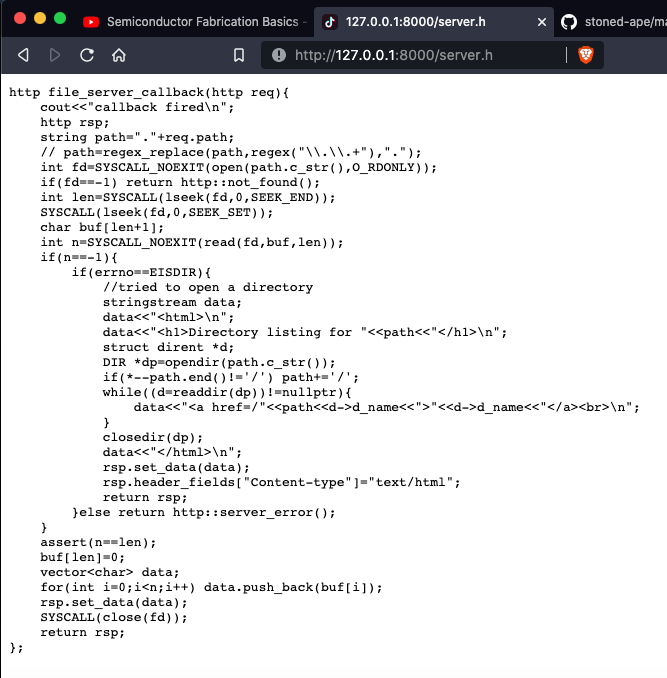
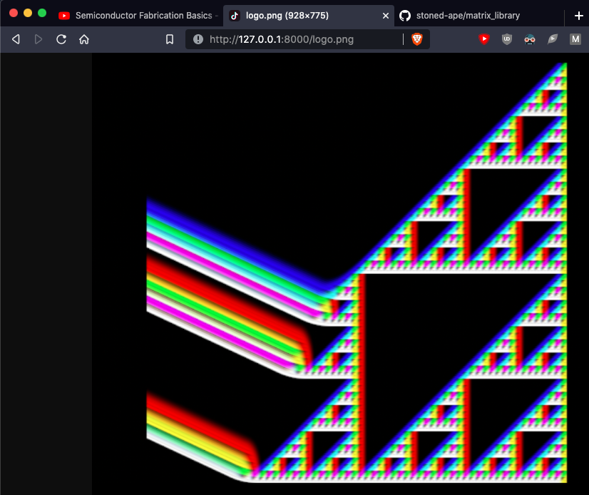

# C++ HTTP Server

This web sever implements the Hypertext Transfer Protocal using only sockets and UNIX standard C library.  Use `make` to build or `make run` to build and run tests.

## Basic File Server
Use `make fs` or `make && ./c_server -fs` to build and run a file server in the current directory. 

### Requesting a directory



### Requesting a file



### Requesting a binary file



## Library Achitecture

To respond to requests, you associate a regex with a callback.
If the requested path matches the regex, the corresponding callback is invoked.
This can be concisely done by passing a lambda function.
An http object representing the request is passed to the callback.
The callback must return an http object representing the response.

```c++
server sv(8000);
sv.set_callback("/a",[](http)->http{
    http rsp;
    stringstream ss;
    ss<<"some data";
    rsp.set_data(ss);
    return rsp;
});

sv.set_callback("/goaway",[](http)->http{
    return http::redirect("/");
});

sv.set_callback("/cookie",[](http req)->http{
    http rsp;
    stringstream ss;
    ss<<req.header_fields["Cookie"];
    rsp.set_data(ss);
    return rsp;
});

sv.run();

```

### Run a file server
```c++
server sv(8000); //set the port to listen on
//set a callback the responds to all requests
sv.set_callback("/[^]*",file_server_callback); 
sv.run();
```

You generally only want to directly serve a subset of files in a "public" directory.

```c++
server sv(8000); 
//only serve files in the public directory
sv.set_callback("/public/[^]*",file_server_callback); 
sv.run();
```


## The HTTP Object

One class that represents both requests and responses.

```c++
struct http{
    int status;			//200, 404, ... -1 if its a request
    string method;		//GET, POST ...
    string path;			
    map<string,string> get_params;
    //usually both 1 for HTTP/1.1
    int maj_version;
    int min_version;
    map<string,string> header_fields; //Cookie, User-Agent ...
    vector<char> data; //HTML or raw files
};
```
It can be constucted directly from request data

```c++
auto h0=http("GET / HTTP/1.1\r\n\r\n");

//with get parameters
str="GET /a/b/c?a=b;c=d HTTP/1.1\r\n\r\n";
auto h0=http(str);

//with cookies
str="GET / HTTP/1.1\r\nCookie: a=b\r\n\r\n";
auto h0=http(str);

//also works for responses
str="HTTP/1.1 200 OK\r\na: b\r\n\r\n";
auto h0=http(str);

```

## Client Request Tools

```c++
//make a generic request
http req("GET / HTTP/1.1\r\n\r\n");
http rsp=server::fetch("127.0.0.1",8000,req);

//make a GET request
http rsp=server::get("http://127.0.0.1:8080/");

//download a file
server::wget("http://127.0.0.1:8080/favicon.ico");

```

## Security

One of the biggest problems for file server designers is dealing with directory traversal vulnerablities.

```bash
#access a private file by using ".."
curl 'http://127.0.0.1/public/../private_file'
```

This could be fixed by input santizing, but there is a more robust solution.
The chroot system call can be used to make all files outside the current
directory inaccessible.  This inaccessiblity is enforced by the kernel.
This type of mitigation is called "sandboxing".

```c++
if(SYSCALL(getuid())==0){ //chroot requires root privilages
	char cwd[MAXPATHLEN];
	getwd(cwd);           //get the current working directory
	SYSCALL(chroot(cwd));
	int newuid=-2;        //UID of unpriveleged user "nobody" on MacOS
	SYSCALL(setuid(newuid)); 
}

```
I'm calling setuid here to avoid the security issues associated with giving a web server root privilages.


//